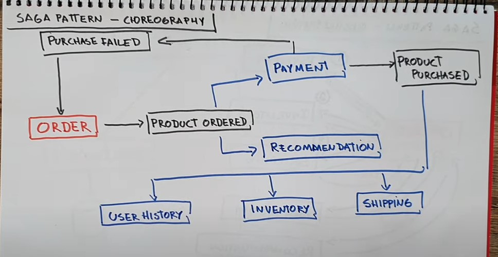
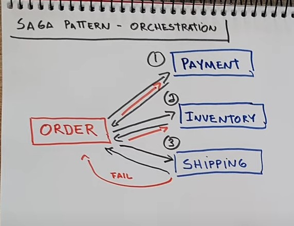

# Saga Research

## Overview

### Two Methods
```
Orchestration - an orchestrator (object) tells the participants what local transactions to execute

Choreography - each local transaction publishes domain events that trigger local transactions in other services
    > A choreography-based saga can publish events using Aggregates and Domain Events (DDD)
```


### Orchestration


```
An e-commerce application that uses this approach would create an order using an orchestration-based saga that consists of the following steps:

1) The Order Service receives the POST /orders request and creates the Create Order saga orchestrator
2) The saga orchestrator creates an Order in the PENDING state
3) It then sends a Reserve Credit command to the Customer Service
4) The Customer Service attempts to reserve credit
5) It then sends back a reply message indicating the outcome
6) The saga orchestrator either approves or rejects the Order
```

### Choreography


```
An e-commerce application that uses this approach would create an order using a choreography-based saga that consists of the following steps:

1) The Order Service receives the POST /orders request and creates an Order in a PENDING state
2) It then emits an Order Created event
3) The Customer Service’s event handler attempts to reserve credit
4) It then emits an event indicating the outcome
5) The OrderService’s event handler either approves or rejects the Order
```


## Extra Context






## Issues to Address

**As stated by Microservices.io Overview**

* In order to be reliable, a service must atomically update its database and publish a message/event. It cannot use the traditional mechanism of a distributed transaction that spans the database and the message broker. Instead, it must use one of the patterns listed below.

* A client that initiates the saga (asynchronous flow) using a synchronous request (e.g. HTTP POST /orders) needs to be able to determine its outcome. There are several options, each with different trade-offs:
  * The service sends back a response once the saga completes, e.g. once it receives an OrderApproved or OrderRejected event.
  * The service sends back a response (e.g. containing the orderID) after initiating the saga and the client periodically polls (e.g. GET /orders/{orderID}) to determine the outcome
  * The service sends back a response (e.g. containing the orderID) after initiating the saga, and then sends an event (e.g. websocket, web hook, etc) to the client once the saga completes.


**Ideas**

* Unique IDs
  * Each service (e.g. User/Order/Post/Comment/Inventory responsible for managment of their resource ids)
  * UUIDs / Snowflakes / Sonyflakes


## Resources

- [Pattern: Saga (microservices.io) [Article/Overview]](https://microservices.io/patterns/data/saga.html)
- [The Saga Pattern in Microservices | EDA - Part 2 (A Dev' Story) [YouTube Video]](https://www.youtube.com/watch?v=C0rGwyJkDTU)